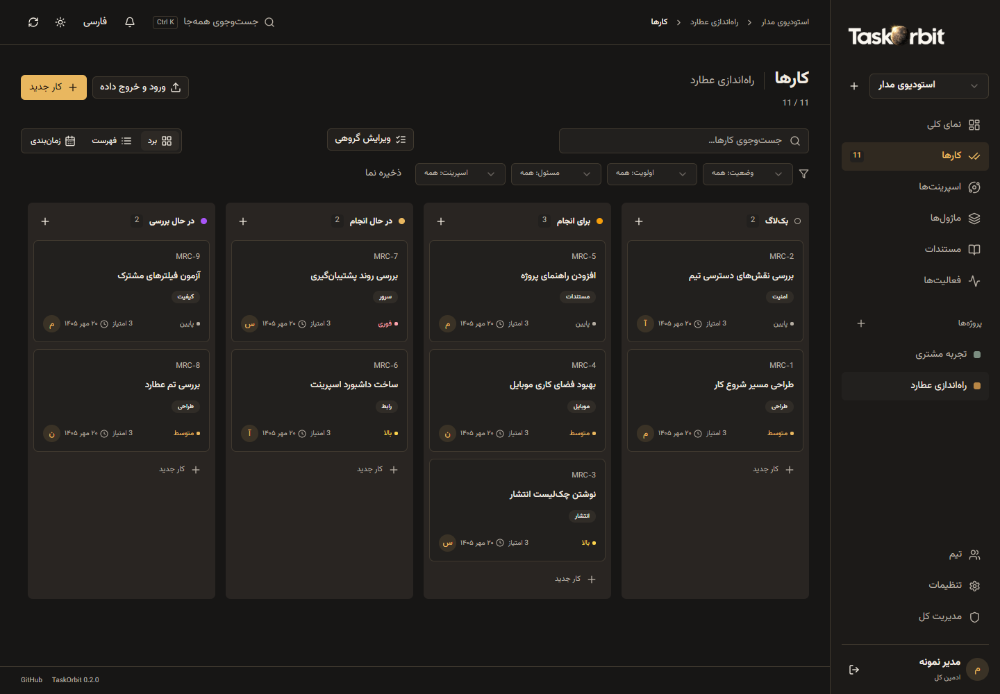
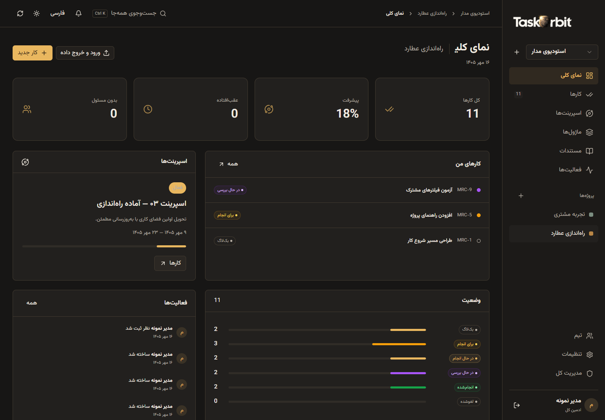
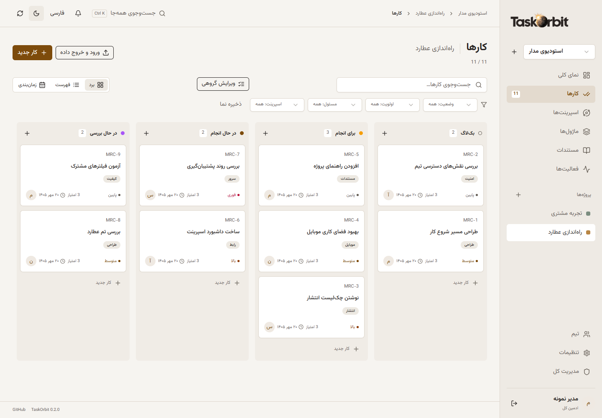
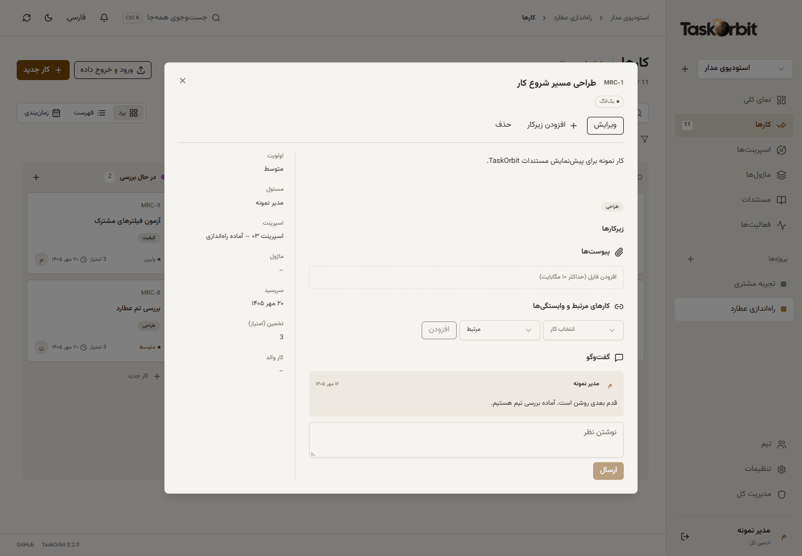

<p align="center"><a href="README.md">English</a> · <strong>فارسی</strong> · <a href="README.ar.md">العربية</a> · <a href="README.zh-CN.md">简体中文</a></p>

<div align="center">
  <picture>
    <source media="(prefers-color-scheme: dark)" srcset="assets/brand/taskorbit-wordmark-v5-dark.png" />
    <source media="(prefers-color-scheme: light)" srcset="assets/brand/taskorbit-wordmark-v5-light.png" />
    
  </picture>
  <h1>TaskOrbit</h1>
  <p><strong>پروژه‌ها، اسپرینت‌ها و کارهای تیم در یک مدار روشن.</strong></p>
  <p>مدیریت پروژهٔ سبک و سلف‌هاست با React، shadcn/ui و Tauri.</p>
  <p>
    <a href="https://github.com/sajadjanat/taskorbit/actions/workflows/verify.yml"></a>
    <a href="https://github.com/sajadjanat/taskorbit/releases"></a>
    
    
    <a href="LICENSE"></a>
  </p>
  <p><a href="#download">دانلود</a> · <a href="#features">امکانات</a> · <a href="#quick-start">شروع سریع</a> · <a href="#updates">به‌روزرسانی</a> · <a href="docs/OPERATIONS.md">Docker</a></p>
</div>



_تصاویر واقعی برنامه با پروژه‌های نمونه و حساب‌های ساختگی گرفته شده‌اند؛ هیچ اطلاعات شخصی پروژه‌ها در آن‌ها نیست._

## چرا TaskOrbit؟

تیم باید بداند چه کاری برنامه‌ریزی شده، قدم بعدی با چه کسی است و چه چیزی آمادهٔ تحویل است. TaskOrbit پروژه‌ها، اسپرینت‌ها و کارها را در رابطی جمع‌وجور روی سرور خودتان کنار هم نگه می‌دارد. با یک کانتینر و SQLite شروع کنید و از مرورگر، دسکتاپ، اندروید یا PWA آیفون متصل شوید.

مدیریت پروژه، اسپرینت و کارهای تیم، سبک و روی سرور خودتان. TaskOrbit نرم‌افزاری مستقل با مجوز MIT برای مدیریت پروژه‌های تیمی است. نسخهٔ فعلی آزمایشی است؛ امکانات موجود و کارهای باقی‌مانده در ادامه معرفی شده‌اند.

## عضوی از خانوادهٔ Orbit

**هر عضو خانوادهٔ Orbit، یک نشان آسمانی و یک مأموریت دارد.** این نشان‌ها روایت ما از نقشی هستند که هر نرم‌افزار در مدیریت کارها ایفا می‌کند.

برای [**GitOrbit**](https://github.com/sajadjanat/gitorbit)، سیاه‌چاله را انتخاب کردیم: نمادی از یک مرکز قدرتمند که پروژه‌ها، مخزن‌ها و ورک‌اسپیس‌های پراکنده را به درون یک محیط مشترک می‌کشد تا بتوانیم آن‌ها را یک‌جا ببینیم و مدیریت کنیم.

برای **TaskOrbit**، عطارد را انتخاب کردیم: کوچک‌ترین سیارهٔ منظومهٔ شمسی با سریع‌ترین حرکت مداری به دور خورشید. این ترکیب برای ما بیانگر هدف TaskOrbit است؛ نرم‌افزاری سبک و سریع که به تیم‌ها کمک می‌کند کارها را هماهنگ کنند، پروژه‌ها و اسپرینت‌ها را برنامه‌ریزی کنند و پیوسته پیش بروند. نور خورشید در نشان آن نیز به نزدیکی عطارد به خورشید اشاره دارد. ویژگی‌های علمی سیاره در [ناسا](https://science.nasa.gov/mercury/facts/) مستندند؛ ارتباط آن‌ها با جهان کار، برداشت ما برای برند است.

**خانوادهٔ Orbit قرار است بزرگ‌تر شود.** هر نرم‌افزار تازه، متناسب با مأموریتش، نشان و شخصیت آسمانی خودش را خواهد داشت؛ ابزارهایی با نقش‌های متفاوت و یک هدف مشترک: نظم‌دادن به جهان کار.

<a id="features"></a>

## امکانات

| امکانات                 | کاربرد                                                                                                                             |
| ----------------------- | ---------------------------------------------------------------------------------------------------------------------------------- |
| **پروژه و فضای کاری**   | چند فضای کاری و پروژه، شناسه و رنگ پروژه و بایگانی.                                                                                |
| **اسپرینت**             | اسپرینت با هدف، تاریخ، وضعیت برنامه‌ریزی‌شده/فعال/تمام‌شده و میزان پیشرفت.                                                         |
| **نماهای کار**          | برد کانبان با کشیدن کارت‌ها، فهرست قابل جست‌وجو و نمای زمانی بر پایهٔ موعد.                                                        |
| **جزئیات تسک**          | توضیح تسک، اولویت، مسئول، اسپرینت و ماژول، تخمین، موعد و برچسب‌ها.                                                                 |
| **ارتباط تسک‌ها**       | زیرتسک، ارتباط کارها و وابستگی مسدودکننده با جلوگیری از چرخه.                                                                      |
| **همکاری**              | تغییرات زنده بین کلاینت‌ها، دیدگاه، تاریخچهٔ فعالیت و پیوست؛ حداکثر ۱۰ مگابایت برای هر فایل و ۲۰ فایل برای هر تسک.                 |
| **دانش پروژه**          | ماژول‌ها، اسناد متنی پروژه و فیلترهای ذخیره‌شدهٔ مشترک.                                                                            |
| **مدیریت تیم**          | ادمین کل، ساخت و غیرفعال‌سازی کاربر، بازنشانی رمز و نقش‌های ادمین/عضو/بینندهٔ فضای کاری.                                           |
| **زبان و ظاهر**         | رابط فارسی، انگلیسی، عربی و چینی ساده‌شده، راست‌به‌چپ/چپ‌به‌راست، فونت محلی و تم روشن/تیره با خاکستری عطارد و طلایی خورشیدی.       |
| **وب و PWA آیفون**      | وب و PWA آیفون/آیپد با صفحهٔ قطع اتصال؛ ویرایش نیازمند اینترنت است.                                                                |
| **کلاینت بومی**         | کلاینت Tauri ویندوز، مک، لینوکس و اندروید با آدرس سرور شخصی قابل تنظیم.                                                            |
| **سرور سبک**            | یک کانتینر سرور و حجم پایدار SQLite؛ بدون Redis، صف پیام و سرویس دیتابیس جداگانه.                                                  |
| **آپدیت برنامه و سرور** | updater امضاشده دسکتاپ، بررسی APK اندروید، بارگذاری مجدد وب/PWA و ارتقای یک‌کلیکی سرور با بکاپ و بازگشت در شکست.                   |
| **کار تیمی**            | جست‌وجوی سراسری با Ctrl/⌘ K، اعلان واگذاری/گفتگو/موعد، کار تکرارشونده، ویرایش گروهی، قالب پروژه و گزارش ظرفیت و توزیع کار اسپرینت. |
| **انتقال پروژه**        | خروجی و ورود JSON و ورود کارها از CSV، با پیش‌نمایش و ذخیرهٔ یک‌جای معتبر. [راهنمای قابلیت‌ها](docs/WORKFLOWS.md).                 |
| **بازیابی رمز**         | لینک بازیابی ایمیلی با SMTP اختیاری؛ راهنمای تماس با مدیر در صورت تنظیم‌نبودن ایمیل. [تنظیمات](docs/PASSWORD-RECOVERY.md).         |

رابط برنامه و README به فارسی، انگلیسی، عربی و چینی ساده‌شده در دسترس هستند. تصاویر هر README از برنامه با همان زبان تهیه شده‌اند.

<details>
<summary><strong>پیشرفت پروژه، تم روشن و جزئیات کار به فارسی</strong></summary>







</details>

<a id="download"></a>

## دانلود

[**TaskOrbit 0.2.0 → GitHub Releases**](https://github.com/sajadjanat/taskorbit/releases/tag/v0.2.0)

| پلتفرم              | بسته یا روش دسترسی            | روش به‌روزرسانی                 |
| ------------------- | ----------------------------- | ------------------------------- |
| Windows x64         | TaskOrbit_0.2.0_x64-setup.exe | updater امضاشده داخل برنامه     |
| macOS Apple Silicon | TaskOrbit_0.2.0_aarch64.dmg   | updater امضاشده داخل برنامه     |
| macOS Intel         | TaskOrbit_0.2.0_x64.dmg       | updater امضاشده داخل برنامه     |
| Linux x64           | DEB / AppImage                | updater امضاشده داخل برنامه     |
| Android arm64       | taskorbit-android-arm64.apk   | APK امضاشده؛ نصب با تأیید کاربر |
| Web / iPhone / iPad | مرورگر / افزودن به صفحهٔ اصلی | بارگذاری مجدد پس از ارتقای سرور |

<a id="quick-start"></a>

## شروع سریع

1. سرور را با Docker طبق راهنمای پایین اجرا کنید.
2. اولین ادمین و فضای کاری را بسازید؛ رمز پیش‌فرض وجود ندارد.
3. در **ادمین کل** حساب بسازید و در **تیم** اعضا و نقش‌ها را اضافه کنید.
4. پروژه و اسپرینت تعریف کنید و کارها را با مسئول، اولویت و موعد بسازید.
5. کارها را با **برد**، **فهرست** یا **زمان‌بندی** دنبال کنید.
6. دستگاه‌ها را به همان سرور HTTPS متصل کنید و زبان و تم دلخواه را انتخاب کنید.

## راه‌اندازی محلی؛ یک کانتینر

```sh
git clone https://github.com/sajadjanat/taskorbit.git
cd taskorbit
docker compose up -d --build
```

آدرس `http://localhost:4310` را باز و اولین ادمین و فضای کاری را بسازید. رمز پیش‌فرض وجود ندارد؛ ثبت‌نام عمومی بعد از ساخت ادمین بسته می‌شود. ادمین کاربران را می‌سازد و از بخش **تیم** به فضای کاری اضافه می‌کند. مرز دسترسی، فضای کاری است؛ اعضای آن همهٔ پروژه‌های همان فضا را می‌بینند.

برای استفاده از ایمیج عمومی آماده:

```sh
docker compose -f compose.image.yaml up -d
```

ایمیج `ghcr.io/sajadjanat/taskorbit:v0.2.0` برای Linux amd64/arm64 است. داده‌های SQLite، حساب‌ها و پیوست‌ها در `taskorbit-data` می‌مانند. دستور `docker compose down -v` این حجم و داده‌ها را حذف می‌کند.

## سرور عمومی با HTTPS؛ دو کانتینر

دامنه را به سرور متصل کنید، پورت‌های ۸۰ و ۴۴۳ را باز کنید و فایل `.env` بسازید:

```dotenv
TASKORBIT_DOMAIN=tasks.example.com
```

```sh
docker compose -f compose.yaml -f compose.https.yaml up -d --build
```

کانتینر دوم Caddy است که گواهی TLS می‌گیرد و درخواست‌ها را به TaskOrbit می‌فرستد. برای ایمیج آماده، به‌جای `compose.yaml` از `compose.image.yaml` استفاده کنید. با پروکسی موجود، فقط کانتینر برنامه لازم است؛ `APP_ORIGIN=https://tasks.example.com` و `NODE_ENV=production` را تنظیم کنید. آدرس origin باید با آدرس مرورگر یکسان باشد. برنامه به‌صورت پیش‌فرض فقط به loopback میزبان Docker متصل است. راه‌اندازی اولیه را زمانی عمومی کنید که مالک برای ساخت ادمین آماده باشد.

<a id="updates"></a>

## به‌روزرسانی

ادمین کل در **پنل ادمین** نسخهٔ جدید را بررسی می‌کند. برای نصب یک‌کلیکی سرور با بکاپ و بازگشت خودکار در شکست، پس از دریافت ایمیج‌ها دستور `docker compose -f compose.image.yaml -f compose.updates.yaml up -d` را اجرا کنید. یک کانتینر ارتقا اضافه می‌شود: مجموعاً دو کانتینر، یا سه کانتینر با Caddy. کلاینت‌های دسکتاپ ۰.۱.۳ به بعد در صفحهٔ اتصال updater امضاشده دارند؛ از منوی **Connection → Server connection and updates…** به آن برگردید. اندروید APK جدید را دریافت می‌کند و نصب به تأیید کاربر نیاز دارد. وب و PWA آیفون پس از ارتقای سرور گزینهٔ بارگذاری مجدد دارند. نسخه‌های قدیمی‌تر یک بار باید دستی به ۰.۱.۳ ارتقا یابند. [راهنمای ارتقا](docs/UPDATES.md).

## نصب روی دستگاه‌ها

فایل‌ها در [ریلیزها](https://github.com/sajadjanat/taskorbit/releases) هستند: ویندوز x64، مک Intel/Apple Silicon، لینوکس x64 و APK اندروید arm64. در اجرای نخست آدرس ریشهٔ سرور HTTPS خود، مانند `https://tasks.example.com` را وارد کنید. اجراهای بعدی خودکار به سرور ذخیره‌شده متصل می‌شوند. برای تغییر سرور از **Connection → Server connection and updates…** و برای بازگشت از **بازگشت به فضای کاری** استفاده کنید. صفحهٔ اتصال رمز را ذخیره نمی‌کند. HTTP فقط برای localhost مجاز است. [همگام‌سازی زنده](docs/REALTIME.md) در کلاینت‌های متصل به سرور ارتقایافته فعال است.

در **آیفون/آیپد** سرور را در Safari باز کنید، سپس Share و **Add to Home Screen** را بزنید. PWA همان حساب‌ها و سرور را استفاده می‌کند و به HTTPS نیاز دارد. فقط آیکن عمومی و صفحهٔ قطع اتصال کش می‌شوند؛ دادهٔ کاری خصوصی در کش Service Worker قرار نمی‌گیرد. همگام‌سازی آفلاین هنوز وجود ندارد.

نسخه‌های ویندوز/مک امضای کد و notarization ندارند؛ APK با کلید پایدار پروژه امضا می‌شود. انتشار در App Store یا Play Store شامل این نسخه نیست. ساخت موفق فایل نصب، جای تست نصب روی دستگاه واقعی را نمی‌گیرد.

## توسعه و آزمون

Node.js نسخهٔ 22.18 یا جدیدتر لازم است:

```sh
npm ci
npm run dev
```

آدرس توسعه `http://localhost:5173` است؛ برای API توسعه `APP_ORIGIN=http://localhost:5173` را تنظیم کنید. اجرای سرور ساخته‌شده:

```sh
npm run build
npm start
```

مقادیر پیش‌فرض: `PORT=4310`، `HOST=127.0.0.1` و `DATABASE_PATH=data/taskorbit.sqlite`.

```sh
npm test
npm run build
npx playwright install chromium webkit
npm run test:e2e
```

آزمون‌ها دیتابیس موقت دارند و به `data/` دست نمی‌زنند. اگر دانلود مرورگر ممکن نیست، با Chrome نصب‌شده اجرا کنید: `PLAYWRIGHT_CHANNEL=chrome npx playwright test --project=chromium`. در PowerShell ابتدا `$env:PLAYWRIGHT_CHANNEL='chrome'` را تنظیم کنید. WebKit با اندازهٔ موبایل، تست آیفون واقعی نیست.

[پیش‌نیازهای Tauri](https://v2.tauri.app/start/prerequisites/) را نصب کنید؛ برای توسعهٔ دسکتاپ `npm run desktop` و برای ساخت روی سیستم هدف `npm run desktop:build -- --bundles nsis` در ویندوز، `--bundles dmg` در مک و `--bundles deb,appimage` در لینوکس را استفاده کنید. اندروید به Java 17، SDK/NDK و `npx tauri android init` سپس `npx tauri android build --apk --target aarch64` نیاز دارد.

## پشتیبان‌گیری و نگه‌داری

خروجی JSON ادمین شامل دادهٔ کار و اطلاعات کاربران است، ولی هش رمز، نشست و بایت‌های پیوست را ندارد؛ نسخهٔ پشتیبان کامل برای بازیابی نیست. برای بکاپ کامل، برنامه را متوقف کنید، حجم `/data` را آرشیو کنید و دوباره اجرا کنید. [راهنمای عملیات](docs/OPERATIONS.md) را ببینید. فایل SQLite شامل پیوست‌هاست؛ کپی فایل هنگام نوشتن فعال، بدون API بکاپ SQLite ایمن نیست.

Compose سقف ۵۱۲ مگابایت حافظه و یک CPU دارد؛ این سقف‌ها ادعای مصرف اندازه‌گیری‌شده نیستند. SQLite WAL برای تیم کوچک و یک نمونهٔ سرور در نظر گرفته شده؛ چند replica را روی فایل دیتابیس مشترک یا شبکه‌ای اجرا نکنید.

## انتشار و محدوده

تگ `v0.2.0` آزمون، ساخت بسته‌های بومی، ایمیج چندمعماری و پیش‌نویس ریلیز را فعال می‌کند. انتشار بعد از موفقیت همهٔ پلتفرم‌ها انجام می‌شود. [یادداشت ریلیز](docs/RELEASE-NOTES.md)، [شواهد آزمون](docs/VERIFICATION.md) و [نقشه راه](docs/ROADMAP.md) محدودیت‌ها و قدم‌های بعدی را توضیح می‌دهند.

فناوری‌ها: React، TypeScript، Vite، Tailwind، کامپوننت‌های واقعی shadcn/ui، Express، SQLite داخلی Node و Tauri 2. فونت Vazirmatn با مجوز OFL است. نشان عطارد با نور گرم خورشید و زمینهٔ سنگی/زغالی در تم‌های برنامه استفاده می‌شود؛ [جزئیات برند](assets/brand/WORDMARK.md).

## مجوز

MIT؛ منابع کامپوننت‌ها و وابستگی‌ها مجوز اصلی خود را حفظ می‌کنند. [اطلاعیهٔ وابستگی‌ها](THIRD-PARTY-NOTICES.md).

## اتصال ایجنت‌ها با MCP

Codex، Cursor، Claude Code، Claude Desktop یا هر ایجنت سازگار را به سرور شخصی وصل کنید. در **تنظیمات ← اتصال ایجنت‌ها · MCP** توکن خواندن یا نوشتن بسازید، تنظیم آماده را کپی کنید، ایجنت را دوباره اجرا کنید و بخواهید فضاهای کاری را فهرست کند. اتصال HTTP و پل محلی stdio موجود است و کانتینر اضافه لازم نیست. مجوز فضای کاری و کنترل تعارض ویرایش همچنان اعمال می‌شود. [آموزش فارسی و رفع خطا](docs/MCP.fa.md). بستهٔ نسخه‌دار stdio در ریلیز گیت‌هاب قرار می‌گیرد. کلاینت‌های صرفاً OAuth در این نسخه پشتیبانی نمی‌شوند.
