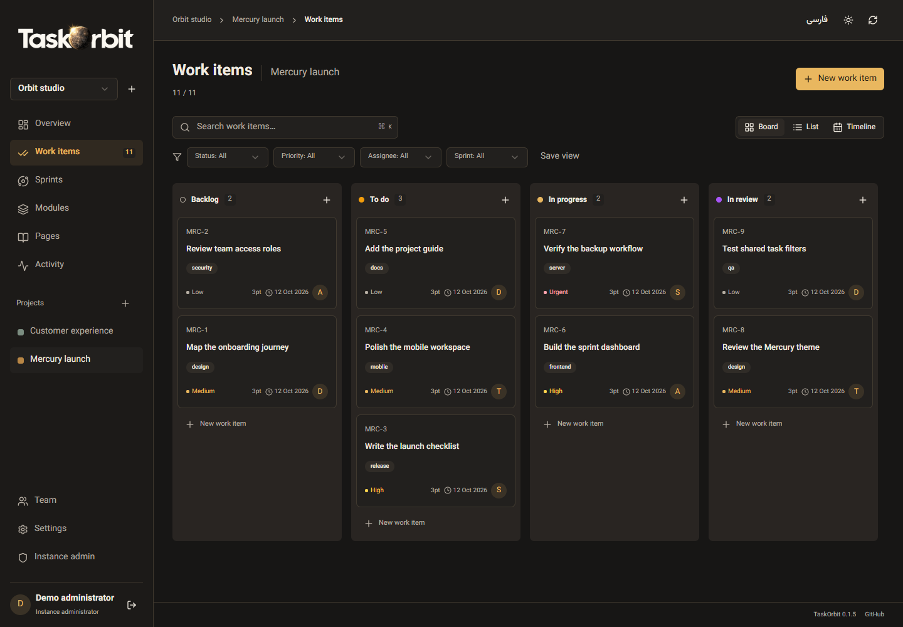
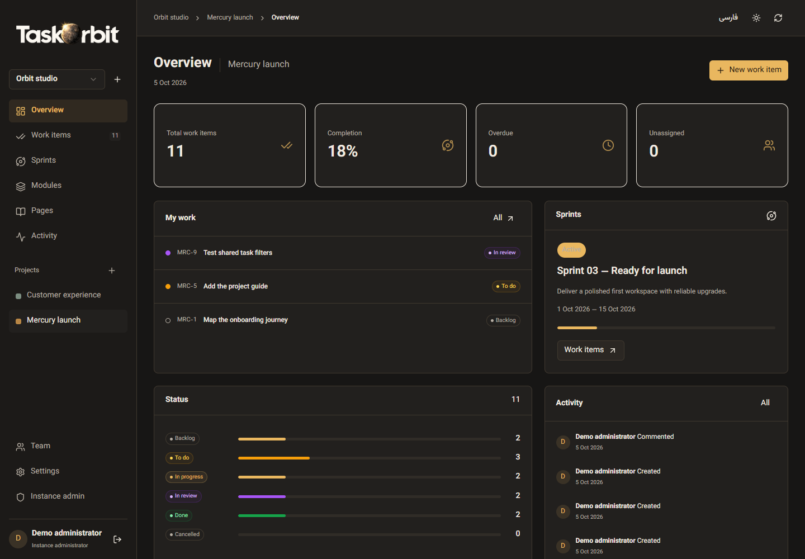
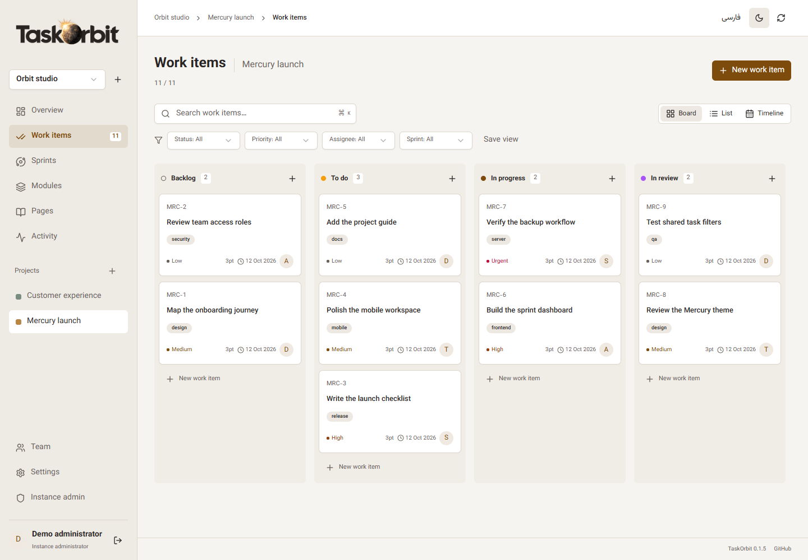
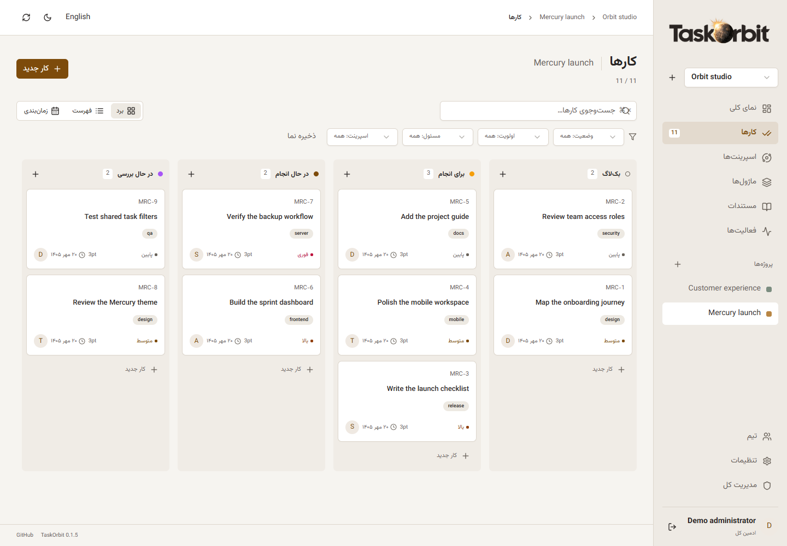

<p align="center"><strong>English</strong> · <a href="README.fa.md">Persian</a> · <a href="README.ar.md">Arabic</a> · <a href="README.zh-CN.md">Simplified Chinese</a></p>

<div align="center">
  <picture>
    <source media="(prefers-color-scheme: dark)" srcset="assets/brand/taskorbit-wordmark-v5-dark.png" />
    <source media="(prefers-color-scheme: light)" srcset="assets/brand/taskorbit-wordmark-v5-light.png" />
    
  </picture>
  <h1>TaskOrbit</h1>
  <p><strong>Keep projects, sprints and team work in one clear orbit.</strong></p>
  <p>Lightweight self-hosted project management, built with React, shadcn/ui and Tauri.</p>
  <p>
    <a href="https://github.com/sajadjanat/taskorbit/actions/workflows/verify.yml"></a>
    <a href="https://github.com/sajadjanat/taskorbit/releases"></a>
    
    
    <a href="LICENSE"></a>
  </p>
  <p><a href="#download">Download</a> · <a href="#features">Features</a> · <a href="#quick-start">Quick start</a> · <a href="#updates">Updates</a> · <a href="docs/OPERATIONS.md">Docker</a></p>
</div>



*Actual application screens captured with disposable example projects and fictional accounts. No personal project data is shown.*

## Why TaskOrbit?

See what is planned, who owns the next step, and what is ready to ship. TaskOrbit brings projects, sprints and work items together in a compact interface, on a server you control. Start with one application container and SQLite, then connect from your browser, desktop, Android or the iPhone PWA.

TaskOrbit is an independent, MIT-licensed application for team project management. The current release is an early preview; implemented features and remaining work are documented below.

<a id="features"></a>

## Features

| Features | What it does |
| --- | --- |
| **Projects & workspaces** | Multiple workspaces and projects, project identifiers, colors and archiving. |
| **Sprints** | Sprints with goals, dates, planned/active/completed states and progress. |
| **Work views** | Kanban with drag-and-drop, searchable list and due-date timeline. |
| **Task details** | Task descriptions, priorities, assignees, sprint/module assignment, estimates, due dates and labels. |
| **Task relationships** | Subtasks, related items and blocking dependencies with cycle prevention. |
| **Collaboration** | Comments, activity history and attachments up to 10 MB each (20 per task). |
| **Project knowledge** | Modules, plain-text project documents and shared saved filters. |
| **Team administration** | Instance administrator, user creation/deactivation/password reset, workspace administrator/member/viewer roles. |
| **Language & appearance** | Persian and English, RTL and LTR, local fonts and light/dark appearance. |
| **Web & iPhone PWA** | Web app and iPhone/iPad PWA with an offline connection screen. Editing requires connectivity. |
| **Native clients** | Tauri clients for Windows, macOS, Linux and Android, with a user-supplied self-hosted server URL. |
| **Small server footprint** | One server container and a persistent SQLite volume. No Redis, message queue or separate database service. |
| **App & server updates** | Signed desktop updates, Android APK checks, web/PWA reload notices, and optional one-click server upgrades with backup and rollback. |

README translations are available in four languages; the application interface currently supports Persian and English.

<details>
<summary><strong>Explore project progress, the light theme and Persian RTL</strong></summary>







</details>

<a id="download"></a>

## Download

[**TaskOrbit 0.1.5 → GitHub Releases**](https://github.com/sajadjanat/taskorbit/releases/tag/v0.1.5)

| Platform | Package / access | Update method |
| --- | --- | --- |
| Windows x64 | TaskOrbit_0.1.5_x64-setup.exe | Signed in-app updater |
| macOS Apple Silicon | TaskOrbit_0.1.5_aarch64.dmg | Signed in-app updater |
| macOS Intel | TaskOrbit_0.1.5_x64.dmg | Signed in-app updater |
| Linux x64 | DEB / AppImage | Signed in-app updater |
| Android arm64 | taskorbit-android-arm64.apk | Signed APK; user-approved installation |
| Web / iPhone / iPad | Browser / Add to Home Screen | Reload after server upgrade |

<a id="quick-start"></a>

## Quick start

1. Start your server with Docker using the instructions below.
2. Create the first administrator and workspace. There is no default password.
3. Create accounts in **Instance admin**, then add members and roles in **Team**.
4. Create a project and sprint, then add work items with assignees, priorities and due dates.
5. Follow the work using **Board**, **List** or **Timeline**.
6. Connect devices to the same HTTPS server; choose Persian or English and light or dark mode.

## Self-host locally (one container)

```sh
git clone https://github.com/sajadjanat/taskorbit.git
cd taskorbit
docker compose up -d --build
```

Open `http://localhost:4310`. Create the first administrator and workspace. There is no default password. Public registration closes after this account is created. The administrator then creates user accounts and adds them to a workspace from **Team**. A workspace is the permission boundary: all its members can see its projects.

To use the published multi-architecture image instead of building from source:

```sh
docker compose -f compose.image.yaml up -d
```

The public image is `ghcr.io/sajadjanat/taskorbit:v0.1.5` for Linux amd64 and arm64. For HTTPS with this image, combine `compose.image.yaml` with `compose.https.yaml` and set the same `TASKORBIT_DOMAIN` described below.

SQLite, attachments and account data persist in `taskorbit-data`. Do not use `docker compose down -v` unless you intend to delete them.

<a id="updates"></a>

## Updates

The instance administrator can check releases in **Admin**. To enable one-click server installation with database backup and automatic rollback, run `docker compose -f compose.image.yaml -f compose.updates.yaml up -d` after pulling the images. This adds one updater container (two total, or three with Caddy). Desktop 0.1.3+ clients have a signed updater on the local connection screen; use the **Updates / Server connection** menu. Android offers the newer signed APK and requires installation approval. Web/iPhone PWA offers reload after your server is upgraded. Versions before 0.1.3 require one manual installation. See the [update guide](docs/UPDATES.md).


## Public server with HTTPS (two containers)

Point a domain at the server, permit inbound ports 80 and 443, and create a `.env`:

```dotenv
TASKORBIT_DOMAIN=tasks.example.com
```

```sh
docker compose -f compose.yaml -f compose.https.yaml up -d --build
```

The second container is Caddy, which obtains TLS certificates and proxies to TaskOrbit. Alternatively, use your existing reverse proxy and only the TaskOrbit container; set `APP_ORIGIN=https://tasks.example.com` and `NODE_ENV=production`. The origin must match the URL used by your browser. The application binds to loopback on the Docker host by default. Do not expose first-run setup until the owner is ready to create the administrator.

### Install on your devices

Download native clients from [Releases](https://github.com/sajadjanat/taskorbit/releases). Each launch opens a connection screen. Enter your own HTTPS server root URL, for example `https://tasks.example.com`, then sign in. The address is remembered; passwords are not stored by the native connection screen. Relaunch the client to choose another server. HTTP is permitted only for localhost development.

On **iPhone/iPad**, open your server in Safari → Share → **Add to Home Screen**. The installed PWA uses the same server and accounts. A secure HTTPS origin is required. The PWA caches only public icons and an offline screen; authenticated work data is not stored in the service-worker cache. No offline synchronization is included yet.

Windows installers and macOS apps are not code-signed/notarized in the preview. Android APKs require the repository's persistent release signing key; do not substitute a new key for each release. An App Store / Play Store listing is not included.

## Development

Requires Node.js 22.18+:

```sh
npm ci
npm run dev
```

Visit `http://localhost:5173` and set `APP_ORIGIN=http://localhost:5173` for the development API. For a built local server:

```sh
npm run build
npm start
```

`PORT` defaults to `4310`, `HOST` defaults to `127.0.0.1`, and `DATABASE_PATH` defaults to `data/taskorbit.sqlite`.

```sh
npm test
npm run build
npx playwright install chromium webkit
npm run test:e2e
```

Tests use temporary databases and do not touch `data/`. On machines where the Playwright browser download is unavailable, run `PLAYWRIGHT_CHANNEL=chrome npx playwright test --project=chromium` against installed Chrome (PowerShell: `$env:PLAYWRIGHT_CHANNEL='chrome'`). The WebKit mobile run is a browser-engine check, not a claim of physical iPhone testing.

For desktop development, install the [Tauri prerequisites](https://v2.tauri.app/start/prerequisites/), then `npm run desktop`. Build on the target OS with `npm run desktop:build -- --bundles nsis` (Windows), `--bundles dmg` (macOS), or `--bundles deb,appimage` (Linux). Android needs Java 17, Android SDK/NDK and `npx tauri android init` followed by `npx tauri android build --apk --target aarch64`.

## Backup and operations

The admin JSON export contains work data and user metadata, but excludes password hashes, sessions and attachment bytes. It is not a complete restore backup. For a complete backup, stop TaskOrbit, archive its `/data` volume, then start it again. See [operations](docs/OPERATIONS.md). The SQLite file holds attachment blobs, so backing up only the file while the server is actively writing is unsafe unless using SQLite's backup API.

The Compose resource settings cap the application at 512 MB and one CPU; these are limits, not measured idle-memory claims. SQLite WAL makes this suitable for a small team on one server instance. Do not run multiple replicas over a shared/network-mounted database file.

## Release and scope

Tag `v0.1.5` triggers verification, native packaging, a multi-architecture server image and a draft release. Publication occurs only after all platform jobs succeed. See [release notes](docs/RELEASE-NOTES.md) and [roadmap](docs/ROADMAP.md) for implemented and remaining features.

Stack: React, TypeScript, Vite, Tailwind, genuine shadcn/ui source components, Express, Node's SQLite API and Tauri 2. Font: Vazirmatn (OFL). The Mercury wordmark and app icon use warm solar lighting, with stone/charcoal surfaces and gold accents throughout both UI themes. Brand artwork was generated from the owner's GitOrbit reference; see [brand details](assets/brand/WORDMARK.md).

## License

MIT. Generated component sources and bundled dependencies retain their original licenses. See [third-party notices](THIRD-PARTY-NOTICES.md).

## How it works

```text
Browser / iPhone PWA ─┐
Tauri desktop/Android ├── HTTPS ── TaskOrbit API + web UI ── SQLite volume
                     ┘                     │
                              optional Docker updater
                           backup → replace → health / rollback
```

| Location | Purpose |
| --- | --- |
| `src/App.tsx` | Projects, sprints, task views and administration. |
| `src/components/ui/` | shadcn/ui source components. |
| `src/components/updates.tsx` | Client/server update panels and web version notice. |
| `server/app.mjs` | Authentication, roles and work-management API. |
| `server/db.mjs` | SQLite schema and persistence. |
| `server/upgrade-engine.mjs` | Docker replacement and rollback. |
| `src-tauri/src/lib.rs` | Server connection and guarded native updates. |

## Contributing

[Report a bug or propose a feature](https://github.com/sajadjanat/taskorbit/issues). Include the version, platform and steps to reproduce, without private project data. Keep the compact interface and all four README files consistent, and run the relevant checks before opening a pull request.

---

Maintained by [sajadjanat](https://github.com/sajadjanat). UI built with [shadcn/ui](https://ui.shadcn.com/), native clients powered by [Tauri](https://tauri.app/).
